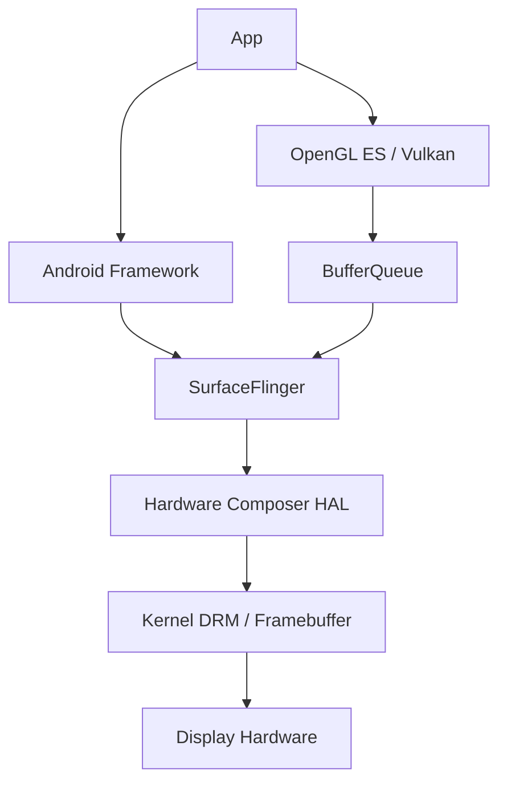
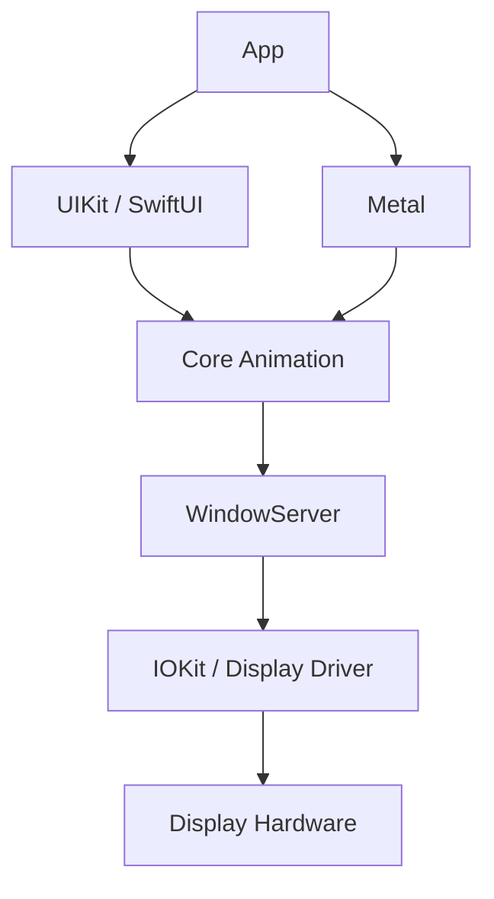
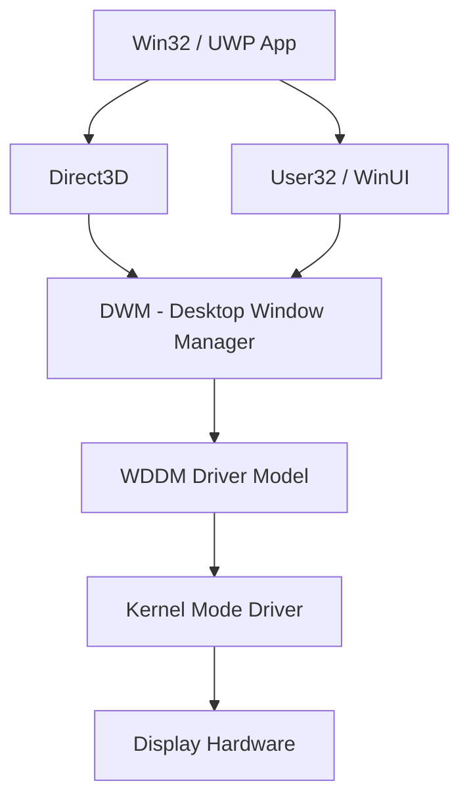
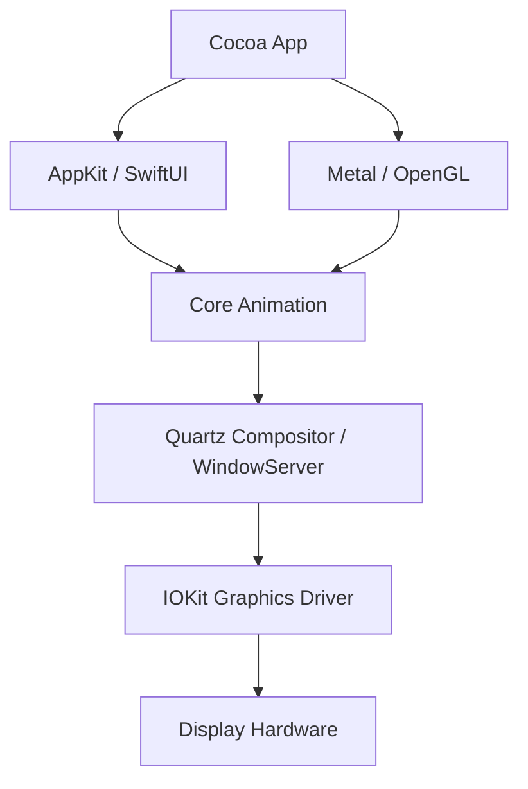
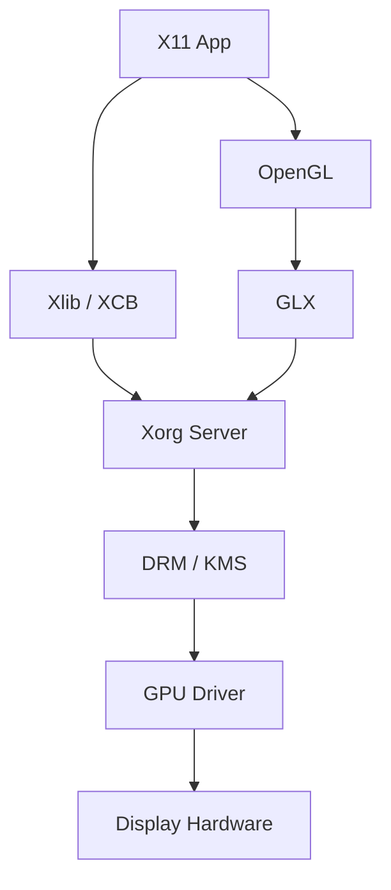
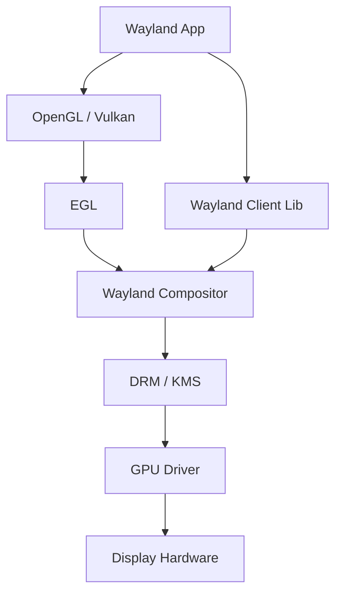
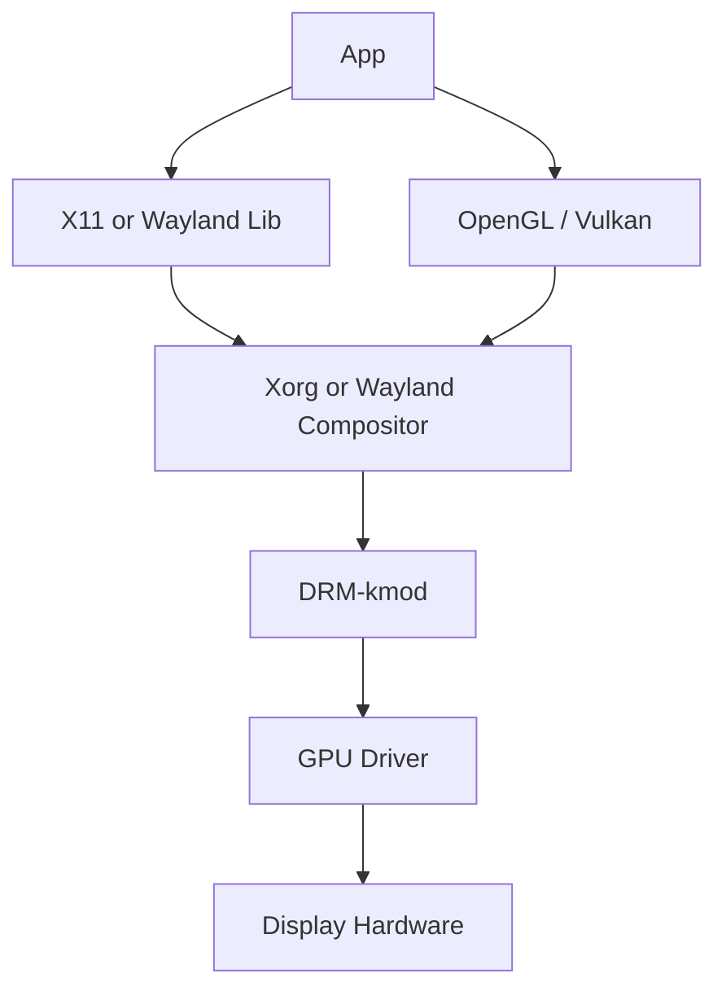

# Display System Architecture Diagrams

---

## Android Display Stack

**Notes**

* SurfaceFlinger is the system compositor.
* Hardware Composer (HWC) offloads composition to GPU or dedicated display hardware.
* Android moved fully away from X long ago; it is a purpose-built stack.

---

## iOS Display Stack

**Notes**

* Core Animation handles compositing.
* Metal is the primary modern graphics API.
* WindowServer coordinates surface composition across apps.

---

## Windows (Modern WDDM + DWM)

**Notes**

* Since Windows Vista, DWM always composites (no true “direct-to-front-buffer” GDI path anymore).
* WDDM virtualizes GPU access.

---

## macOS (Quartz Compositor)

**Notes**

* Quartz Compositor handles compositing.
* Metal is the preferred API; OpenGL is deprecated.

---

## UNIX-like (Xorg / X11)

**Notes**

* Xorg acts as both display server and compositor (unless using a compositing WM).
* Protocol is network-transparent by design.
* GLX bridges OpenGL and X11.

---

## UNIX-like (Wayland)

**Notes**

* No central “display server” like Xorg.
* Compositor (e.g., Mutter, KWin, wlroots-based) owns display control.
* Clients cannot directly inspect other windows (security improvement over X11).

---

## FreeBSD (Typical Modern Setup with Xorg or Wayland)

**Notes**

* FreeBSD does not define its own display protocol.
* It typically uses Xorg or Wayland via the DRM compatibility layer.

---

## Comparative Tables

| System                 | Display Server / Compositor            | Graphics API Focus | Network Transparency          | Window Isolation                                | Rendering Path Model                               | Kernel Interface |
|------------------------|----------------------------------------|--------------------|-------------------------------|-------------------------------------------------|----------------------------------------------------|------------------|
| Android                | SurfaceFlinger                         | Vulkan / OpenGL ES | No                            | Strong (sandboxed apps)                         | BufferQueue + hardware composition (HWC)           | Linux DRM / KMS  |
| iOS                    | WindowServer + Core Animation          | Metal              | No                            | Strong (strict sandbox)                         | Layer-based compositing                            | IOKit            |
| Windows                | Desktop Window Manager (DWM)           | Direct3D 11/12     | No (RDP separate)             | Strong                                          | Always composited, WDDM GPU virtualization         | WDDM             |
| macOS                  | Quartz Compositor / WindowServer       | Metal              | No                            | Strong                                          | Core Animation layer tree                          | IOKit            |
| UNIX-like (Xorg / X11) | Xorg (optional compositor)             | OpenGL / Vulkan    | Yes (native protocol feature) | Weak by design (clients can inspect each other) | Mixed: server-side + DRI direct rendering          | DRM / KMS        |
| UNIX-like (Wayland)    | Wayland compositor (e.g. Mutter, KWin) | OpenGL / Vulkan    | No (by design)                | Strong (client isolation enforced)              | Client-side rendering, compositor controls display | DRM / KMS        |

If you look closely, the convergence pattern is obvious: mandatory compositing, GPU-managed buffers, and strict isolation everywhere except legacy X11. The outlier isn’t Android or iOS — it’s the historically network-transparent UNIX-like model that trusted every client. That trust model was elegant in 1987. In 2026, it’s mostly a liability.
