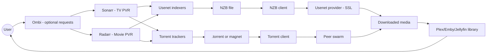
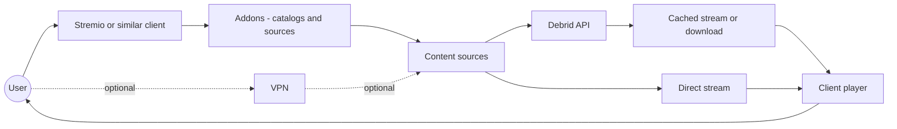
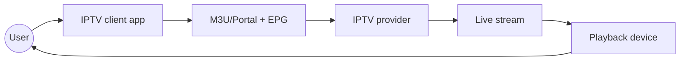
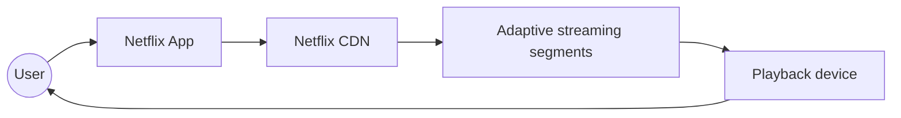

# Media Streaming Diagrams

Below are Mermaid diagrams that illustrate library clients, streaming aggregators, IPTV, and Netflix-style streaming. These are conceptual flows meant for comparison.

## Library Client (server-based)

## Streaming Aggregator Client (addons + debrid)

## IPTV workflow (client + provider)

## Netflix (centralized streaming)

## Pros and Cons by Workflow

| Workflow                          | Pros                                                | Cons                                               |
| --------------------------------- | --------------------------------------------------- | -------------------------------------------------- |
| Library client (server-based)     | Full library control; automation friendly           | More services and setup; storage required          |
| Streaming aggregator client       | Simple app UX; broad catalogs; fast cached streams  | Addon churn; third-party risk; uneven metadata     |
| IPTV workflow                     | Live channels; simple client setup                  | Provider quality varies; unstable lineups          |
| Netflix (centralized streaming)   | Stable quality; easy setup; consistent UX           | Region-locked catalog; ongoing cost; DRM limits    |
